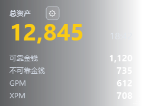
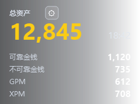
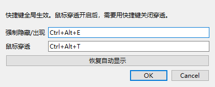

# Dota2 Economy Overlay

## 项目简介

Dota2 Economy Overlay 是一个本地运行的 Dota2 实时经济覆盖层，用来在游戏前端显示个人经济信息：总资产、可靠金钱、不可靠金钱、GPM 和 XPM。

这个项目 **只使用 Valve/Dota2 公开支持的 Game State Integration（GSI）接口获取数据**。它不会修改 Dota2 客户端，不会解包资源，不会读取游戏内存，不会注入进程，也不会绕过反作弊。因此它不是外挂性质的功能，而是一个基于公开接口的数据展示工具。

技术栈：

- Python 3.10+
- PySide6 / Qt：绘制无边框透明覆盖层
- Dota2 Game State Integration：接收 Dota2 本地推送的比赛状态数据
- Python `http.server`：本地 HTTP 接收 GSI 数据
- Windows `RegisterHotKey`：全局快捷键
- OpenDota `dotaconstants`：公开物品价格表，用于估算总资产

主要功能：

- 自动计算总资产：当前金币 + 装备/背包/储藏处物品价值
- 显示可靠金钱、不可靠金钱、GPM、XPM
- 未进入对局时自动隐藏，进入对局后自动显示
- 支持强制隐藏/出现快捷键
- 支持鼠标穿透快捷键
- 支持窗口拖动、右下角等比例缩放
- 背景为半透明灰色淡出渐变，文字保持不透明

## 安装说明

### 一键安装并启动

推荐普通用户使用这个方式。

1. 确认电脑已安装 Python 3.10 或更新版本。
2. 双击运行：

   ```text
   一键安装并启动.bat
   ```

3. 脚本会自动完成：

   - 安装 PySide6
   - 写入 Dota2 GSI 配置
   - 启动经济覆盖层

如果脚本没有找到你的 Dota2 安装目录，请使用手动安装方式。

### 手动安装

在当前项目目录打开 PowerShell，执行：

```powershell
python -m pip install PySide6
python .\install_gsi_config.py
python .\economy_overlay.py
```

如果自动查找 Dota2 失败，手动传入 Dota2 根目录：

```powershell
python .\install_gsi_config.py "D:\SteamLibrary\steamapps\common\dota 2 beta"
```

如果 Dota2 没有推送数据，请在 Steam 的 Dota2 启动项里加入：

```text
-gamestateintegration
```

然后重启 Dota2。

## 使用说明

### 1. 启动覆盖层

双击 `一键安装并启动.bat`，或者手动运行：

```powershell
python .\economy_overlay.py
```

未进入对局时，窗口会自动隐藏，这是正常行为。

覆盖层 UI 截图如下。右侧会自然淡出，不会留下明显边界；文字本身保持不透明，便于在游戏画面上阅读。



### 2. 进入对局后查看经济

进入 Dota2 对局后，覆盖层会自动显示。默认只展示以下字段：

- 总资产
- 可靠金钱
- 不可靠金钱
- GPM
- XPM

总资产的计算方式：

```text
总资产 = 当前持有金币 + 物品栏/背包/储藏处物品价值
```

UI 截图：


界面字段对应含义：

- `总资产`：当前金币 + 已购买物品价值
- `可靠金钱`：死亡不会掉落的金币
- `不可靠金钱`：死亡可能掉落的金币
- `GPM`：每分钟金钱
- `XPM`：每分钟经验
- 右上角小齿轮：打开设置面板
- 右下角短线：缩放热区

### 3. 强制显示或隐藏窗口

默认快捷键：

```text
Ctrl + Alt + E
```

用途：

- 窗口自动隐藏时，按一次可以强制显示
- 窗口显示时，按一次可以强制隐藏
- 在设置面板里可以恢复自动显示逻辑

### 4. 鼠标穿透

默认快捷键：

```text
Ctrl + Alt + T
```

用途：

- 开启后，鼠标点击会穿过覆盖层，直接作用到 Dota2
- 关闭后，可以拖动窗口、缩放窗口、打开设置

注意：鼠标穿透开启后，不能用鼠标点窗口关闭穿透，需要再次按快捷键。

鼠标穿透开启时，窗口不再响应鼠标点击、拖动和缩放。下图是鼠标穿透状态下的 UI 截图，右下角缩放热区不会显示：



### 5. 打开设置

窗口中“总资产”右侧有一个小齿轮按钮。

点击后可以设置：

- 强制隐藏/出现快捷键
- 鼠标穿透快捷键
- 恢复自动显示

设置会保存到：

```text
overlay_settings.json
```

设置面板 UI 截图：



### 6. 移动窗口

鼠标穿透关闭时，在窗口空白区域按住左键拖动即可移动位置。

### 7. 缩放窗口

鼠标穿透关闭时，拖动窗口右下角的缩放热区即可缩放。

缩放规则：

- 只允许等比例缩放
- 文字、按钮和窗口会一起缩放
- 鼠标穿透开启时，缩放不可用

右下角缩放热区 UI 截图：


## 常见问题

### 为什么未进入对局时看不到窗口？

这是自动隐藏逻辑。进入对局后会自动显示。也可以按 `Ctrl + Alt + E` 强制显示。

### 为什么没有数据？

请检查：

- 是否已经运行 `install_gsi_config.py`
- 是否重启过 Dota2
- Dota2 启动项是否加入了 `-gamestateintegration`
- 覆盖层程序是否正在运行

### 总资产为什么是估算值？

Dota2 GSI 会推送当前金币和物品栏数据。程序根据公开物品价格表计算物品价值，再加上当前金币得到总资产。物品价格来自 OpenDota `dotaconstants`，会缓存到 `item_prices.json`。

如果 Dota2 更新了物品价格，可以删除 `item_prices.json` 后重新启动程序，程序会重新拉取价格表。

### 这会封号吗？

项目不修改游戏、不读内存、不注入进程，只接收 Dota2 官方 GSI 本地 HTTP 数据。从功能性质上，它是外置数据展示工具，不是自动操作或作弊工具。实际使用仍建议遵守 Dota2/Steam 的服务条款。
